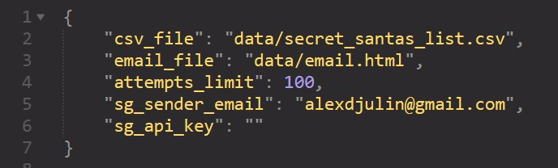

# Secret Santa
_Draw and email your Secret Santas using Python and Sendgrid... Ho ho ho!_ 🎅

## Description
This little script allows you to randomly draw and assign Secret Santas within a group of people. It offers the possibility to add a 'black list' too, i.e. a list of recipients that one Secret Santa should NOT have (in case of incompability, people not getting along with each other or similar reason). If the assignment is successful, Secret Santas will be notified per email and told who their recipient is. This way, no member of the group needs to be in charge of the assignment and know more than who his/her own recipient is.

## User input / Requirements
The input happens via a CSV file, where you can specify:
+ The name of the group members / string, mandatory
+ Their email / string, mandatory
+ A black list / group members' names as strings separated by a '|', optional
Lines with no name and blank lines are ignored. Do not change the column headers text.

  </a>

Some additional parameters need to be specified too. For clarity and to avoid having to look for them in the main script, they are specified in a settings.json file.

+ csv_file: [string] Path to the CSV file containing Secret Santas inforomaton
+ email_file: [string] Path to email template (.txt or .html) used to contact Secret Santas. The strings **'[NAME]'** and **'[RECIPIENT]'** inside the file will be replaced by the corresponding strings from the current SecretSanta instance.
+ attempts_limit: [int] Number max of attempts that should be done while trying to assign recipients to secret santas. Due to the black lists, an assignment may be impossible and therefore this variable will break the while loop and raise an error.
+ sg_sender_email: [string] email of your SendGrid account
+ se_api_key: [string] your personal SendGrid API key (private, don't share it with ANYONE). Leave blank to call the one from your environment variables

  </a>

