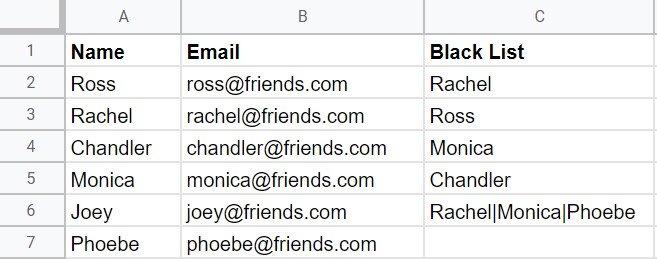
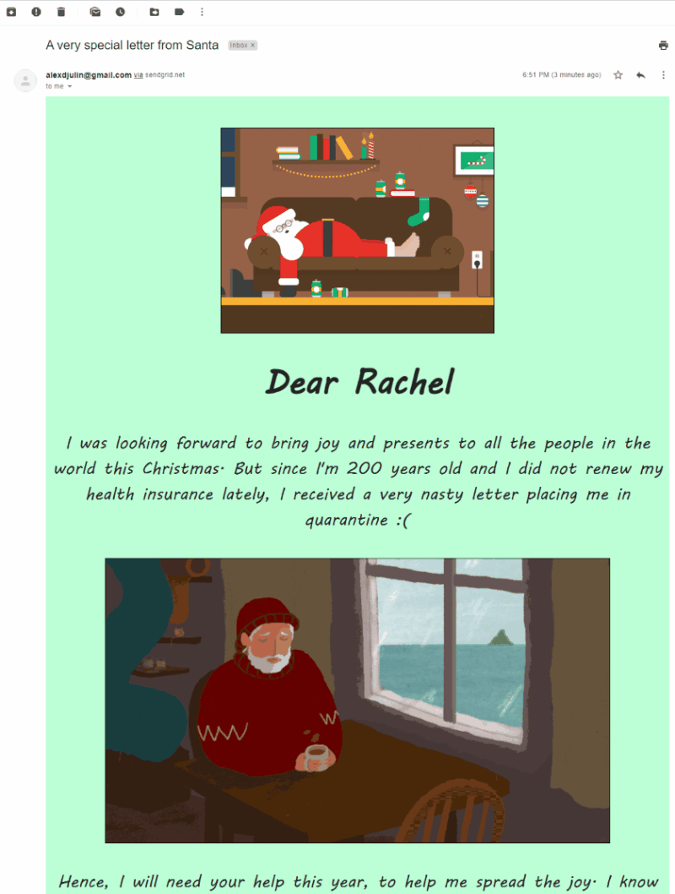

# Secret Santa
_Draw and email your Secret Santas using Python and Sendgrid... Ho ho ho!_ 🎅

## Description
This little script allows you to randomly draw and assign Secret Santas within a group of people. It offers the possibility to add a 'black list' too, i.e. a list of recipients that one Secret Santa should NOT have (in case of incompability, people not getting along with each other or similar reason). If the assignment is successful, Secret Santas will be notified per email and told who their recipient is. This way, no member of the group needs to be in charge of the assignment and know more than who his/her own recipient is.

## User input / Requirements
The input happens via a CSV file, where you can specify:
+ **Name** [string] of the group members, mandatory
+ **Email** [string] of the group members, mandatory
+ **Black list** [string] group members' names separated by '|', optional
Lines with no name and blank lines are ignored. Do not change the column header's text.

<p align="center">
  </a>
</p>

Some additional parameters need to be specified too. For clarity and to avoid having to look for them in the main script, they are specified in a settings.json file.

+ **csv_file**: [string] Path to the CSV file containing Secret Santas inforomaton
+ **email_file**: [string] Path to email template (.txt or .html) used to contact Secret Santas. The strings **'[NAME]'** and **'[RECIPIENT]'** inside the file will be replaced by the corresponding strings from the current SecretSanta instance.
+ **attempts_limit**: [int] Number max of attempts that should be done while trying to assign recipients to secret santas. Due to the black lists, an assignment may be impossible and therefore this variable will break the while loop and raise an error.
+ **sg_sender_email**: [string] email of your SendGrid account
+ **sg_api_key**: [string] your personal SendGrid API key (private, don't share it with ANYONE). Leave blank to call the one from your environment variables

```json
{
    "csv_file": "data/secret_santas_list.csv",
    "email_file": "data/email.html",
    "attempts_limit": 100,
    "sg_sender_email": "alexdjulin@gmail.com",
    "sg_api_key": ""
}

```

## Installing and using SendGrid
Twilio SendGrid provides a cloud-based service that assists businesses with email delivery. The free offer allows you to send up to 100 emails a day, which is good enough for our little project.
+ [Create a SendGrid account](https://sendgrid.com/free/) 
+ [Create a Single Sender Verification](https://docs.sendgrid.com/ui/sending-email/sender-verification) 
+ [Create a personal API key](https://docs.sendgrid.com/ui/account-and-settings/api-keys) 
+ [Install the SendGrid python library](https://github.com/sendgrid/sendgrid-python) <br/><br/>
Look at this last link for simple examples on sending emails using python. This project uses the *"Without Mail Helper Class"* example.

## Running the script
Once you filled up the CSV and JSON files, and tested sending an email using your SendGrid account, you can run the script or place the contents of the MAIN inside a function that you can call from another script.

The script will read your CSV file and create SecretSanta instances for each member of the group. Then it will try to assign recipients to Santas until the black lists conditions are respected. If it fails after X attempts (specified in the json file), it will consider the task impossible and give up. If the assignment is successful though, it will send an email to each Secret Santa. Email contents are loaded from txt or html templates (specified in the json file). If not template is passed, a default text will be used.

## Output
After executing without any error, the script will confirm the successful assignment of recipients to Secret Santas and tell you how many attempts were necessary. It will print the result of the assignment and confirm that each Secret Santa has been contacted per email.

```
The Secret Santa assignment was successfull after 3 attempts
Secret Santa: Rachel - Recipient: Joey
>> Rachel has been notified per E-Mail
Secret Santa: Monica - Recipient: Phoebe
>> Monica has been notified per E-Mail
Secret Santa: Phoebe - Recipient: Chandler
>> Phoebe has been notified per E-Mail
Secret Santa: Ross - Recipient: Monica
>> Ross has been notified per E-Mail
Secret Santa: Joey - Recipient: Ross
>> Joey has been notified per E-Mail
Secret Santa: Chandler - Recipient: Rachel
>> Chandler has been notified per E-Mail
```

## Email personalization
You can use a simple text file as email template or a complex html one. Visit the SendGrid documentation for more information on this.

<p align="center">
  </a>
</p>
